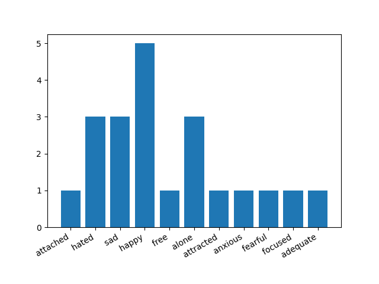

# Sentiment-Analysis
>Sentiment Analysis in python to determine the hidden meaning and hidden expressions present in the unstructured text data format as positive, negative or neutral.

## Usage

1. Open your Terminal/cmd

2. git clone this project to your preferred directory.

3. `cd Sentiment-Analysis`

4. `python SentimentAnalysis.py`

<br/>

or Execute:


```
Execute_SentimentAnalysis.cmd
```


## Dependencies

- NLTK (http://www.nltk.org/)

## Installation
Set up a virtual environment and install the dependencies:
```sh
pip install -r requirements.txt
```

## License
This project is licensed under the terms of the [GLP-3.0 license](https://github.com/yyscoop/Sentiment-Analysis/blob/master/LICENSE)
